# floor-control experiments

## Evaluating the floor control detection (FCD) model

The FCD model is evaluated using multiple measures, against the annotated DUEL dataset (Hough et al. 2016), and compared with competitor models.
One of these competitors is a state-of-the-art general turn-taking LSTM model (Skantze, 2017).
We replicated that model with [keras](https://keras.io/).

## How to use

1. Make sure you have python install. The authors use version 3.8.6, but anything above 3.6 should work.
1. Enter the experiments folder with `cd experiments`.
1. Install dependencies with ``pip install -r requirements.txt``. Using a virtual environment and/or [pip-tools](https://github.com/jazzband/pip-tools) is highly recommended.
1. Run the analysis notebook with `jupyter notebook`.

For reproducibility, the analysis notebook processes the data found in the `features`, `models`, and `predictions` directories that are provided with this repository. If you don't worry about generating these directories by yourself stop reading.

The data provided in this repository is generated from the DUEL dataset in a few steps, by a set of scripts, as presented in this graph.

Diamond shapes indicate data, and rectangles indicate scripts. The darker nodes indicate data and scripts that can be run only if you have the raw DUEL data available. If you don't, you can still run the scripts indicated by bright rectangle. Explanation about the content of each directory can be found next.

To run the darker scripts run `make duel`. To run the brighter scripts run make `make reproduce`. To run the entire graph run `make all`.

### Important usage notes!

- Every script first empties its output directory before execution. For example, the `train_lstm.py` script empties the `models/LSTM` directory at the start of its execution.
- The `train_lstm.py` script takes a few hours to run on a 2017 laptop.

## Data

The German subset of the DUEL dataset is comprised of 30 session "parts", with 2 participants having free dialogues. The audio from each participant microphone is part of the dataset, as well as manuall annotattion of their utterances.

### `features/utterances`

Here you can find a `.csv` file for each session part with descriptions of utterances annotated in the dataset. Each row is for a single utterance, with columns for `start_time` (float), `end_time` (float), `participant` (0 or 1), and `backchannel` (0 or 1) indicating if the utterance is considered a backchannel. Refer to the paper for info about the later.

### `features/FCD`

Here you can find a `.npy` file for each session part with one column per participant (2 columns). The values are RMS values of the audio from their microphones, sampled at 50Hz.

### `features/LSTM`

Here you can find **two** `.npy` file for each session part. The files starting with `X` are for features, with 6 columns per participant, sampled at 20Hz. See the paper for details. The columns are ordered like that `[participant0_feature0, participant1_feature0, participant0_feature1, ... , participant1_feature5]`. The files starting with `y` have one column per participant and indicate voice activity (0 or 1) for each of them. Sample rate is the same.

### `models/LSTM`

Here you can find two models, `model_0.h5` and `model_1.h5`. Model `model_k.h5` is trained with the `X` files above to predict column `k` from the `y` files above.

### `predictions/FCD`

Here you can find a `.npy` file for each session part with one column of 0, 1, or NaN, indicating which participant is the floor holder at a sample rate of 50Hz.

### `predictions/LSTM`

Same as `predictions/FCD` but with sample rate of 20Hz.

### `predictions/VAD`

Same as `predictions/FCD`.

## Bibliography

- Hough, J., Tian, Y., de Ruiter, L., Betz, S., Kousidis, S., Schlangen, D., and Ginzburg, J. (2016). Duel: A multi-lingual multimodal dialogue corpus for disfluency, exclamations and laughter. In 10th edition of the Language Resources and Evaluation Conference.

- Skantze, G. (2017). Towards a general, continuous model of turn-taking in spoken dialogue using lstm recurrent neural networks. In Proceedings of the 18th Annual SIGdial Meeting on Discourse and Dialogue, pages 220--230.
